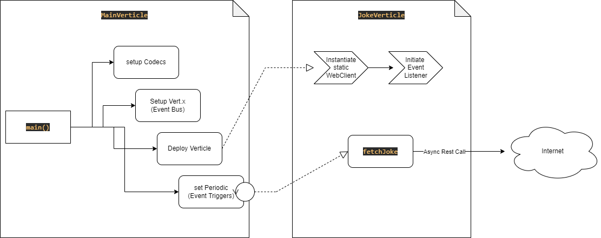

# Project's functionality:

Dad Jokes! Yes... a software that fetches dad jokes from the internet at a configurable interval and prints them to your screen!

# Project's purpose:

This is a project I worked on to experiment with Async + Event Driven Design and Vert.x libraries. 
The underlying project fetches dad jokes from the internet and prints them to the console. 
The code base is a complete over-engineering for the underlying task because I wanted to simulate a proper enterprise setting. 
A more straight forward implementation of this code exists under the **kiss** package (**K**eep **I**t **S**traight and **S**imple)

## How to Run:

To run the code, visit hobby.MainVerticle and run main method. 
You can tweak the frequency of the jokes in the config-local.json file.

The project is written in Java 17 and gradle 7.

### Design:

